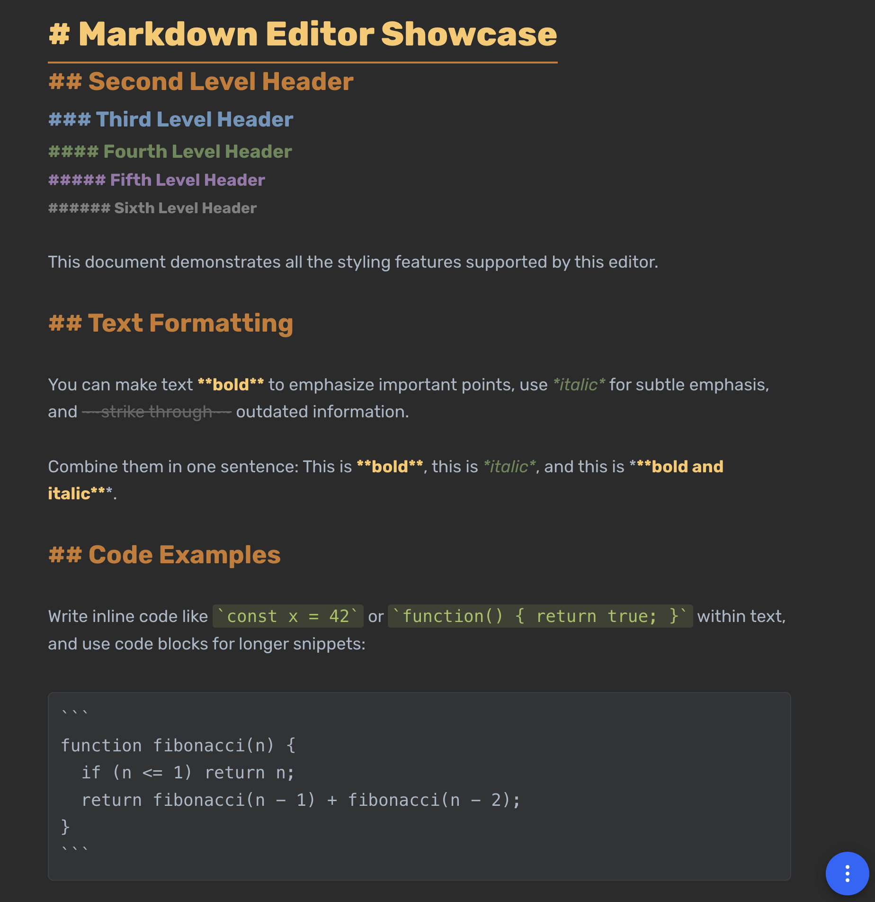

# [halyph/textarea](https://halyph.github.io/textarea/)

A _minimalist_ markdown editor with beautiful Darkula styling that lives entirely in your browser and stores everything in the URL hash.




## Examples

- [A Markdown Example](https://halyph.github.io/textarea/#bVRNcxs3DL3zV7x6L_ZGkh23J7k5tKpVe-rMZCxNMr2JS0K7rLjEDj8sKZnot3e4K9mu0xuJBwIPwAMLfJR-o3nrcKtNZI9Fw1slA4miwIIUO40HeiKLO5KavCiKAsvG-B_NBeacfGx-BArMzfp_gQILs3uLiGVjAjSr1JKL0NSyC9HLSAHSWsSGEOLeGldjTTImTwEhdR37SBrVHjEHoL6giciVLGkXMWffyhiNq4X4mxOUdGjlhhAzWpYVW12WiAxqu0YG85Vg2hxVuoiOjYthhBQIpYnSGlVizR4hVdHS6U0YQTqNwyFEb3LsxnOqm8MBnKKWmaBx656JYTcRYsZtZVx2pBbGgR0hkIvkFE3Rt8KEZ3ajobZsOXIY8j1bB8fednQoy6EHM9aE251sO0tBiC_eRIJxNidXGbOZ70rlZmOHD_jlegX2WK2TU5ns-QW-wVNM3iH6RDf4vsLWxMa4voUDk9yfPlxlWW1C3yLLriaP4EzXUQxTIVarlTjFxdpU7KRS5txd4JsAzBrnDr9-wPuLU0J3I3A6v_LHOPu8e2O6vrgR3_scufAH4zah5_ZIa_K5sUGIWUNqk4eCJsYuTC8vaxObVE0Utz1p7sghcPKK0Hn-h1QMEyE-m2Be3ugsXO7IT1r-aqyVE_Z1_3xL1bOGT7MuCvxF-4ql13nRfFQpBiHGKMtZ9PZy1mq8w-_lIKzTzN_i9yf8OOC3-GIQcZBPBBlwt_z40Kd-JGnHX9hbfZKB6Nf501Ac_njNVoiyXEQZUyjLKcp7l91qTyGUGfpMPhh2GVtdT95PrlZ5bQmOtvBkSYasLWWTpoDDwVIt1R6_fbo_HNCyJu_weLtYgpweFqvfBLc2dfJ9ftBA8aiVrIqzvIpnU_x8dXU1yveGQ76fWVbS9pferKlK9dm01-hJBnP2aNnT6-Ub4ek_szxmzAK41KzyYMZjIcrly29y-mYC_jTxLlWYW_nEnvTLP5oXAtY8EcLeRblDY-rGmrrJH89PpRD_Ag==)


## Features

- 🗜️ **Compression** – Your text gets compressed with deflate
- 🔗 **URL hash** – Share your notes by copying a URL
- 🎨 **Darkula Styling** – Beautiful JetBrains-inspired dark theme with distinct colors for each element
- ✨ **Live Markdown** – Real-time syntax highlighting with colored headers, bold, italic, and code
- ⌨️ **Keyboard Shortcuts** – Ctrl/Cmd+B for bold, Ctrl/Cmd+I for italic
- 🔤 **Rubik Font** – Clean, modern typography for improved readability

## How It Works

### Core Architecture

**ContentEditable Element**
- Uses an `<article contenteditable="plaintext-only">` element
- User types directly into this element
- `plaintext-only` prevents rich HTML formatting from paste operations

**Live Syntax Highlighting**
- After each keystroke (debounced by 30ms), the editor:
  1. Saves cursor position
  2. Extracts plain text content
  3. Parses it with regex matchers to find markdown patterns
  4. Replaces content with styled HTML fragments
  5. Restores cursor position

**Supported Markdown Syntax**
- Headers: `# Title`, `## Title`, etc. (H1-H6 with distinct colors)
- Bold: `**text**` or `__text__` (rendered in gold)
- Italic: `*text*` or `_text_` (rendered in green)
- Strikethrough: `~~text~~`
- Inline code: `` `code` `` (rendered in green with background)
- Code blocks: ` ```code``` ` (rendered in elevated panel)
- URLs: Auto-detected HTTP(S) links (clickable)

**Custom Editor**
- Manages contenteditable behavior with cursor preservation
- Custom undo/redo with history stack (up to 10,000 entries)
- Complex logic to maintain cursor position through DOM transformations

**Data Storage**
- Stores plain text (not HTML) in URL hash
- Uses deflate compression via `CompressionStream` API
- Encodes to base64url for URL-safe sharing
- Also saves to localStorage as backup
- Format: `#<compressed-data>` optionally with `\x00<style>` for custom CSS

**Key Features**
- Real-time rendering: Type markdown, see formatted output
- URL-based storage: Entire document lives in URL hash
- No server needed: Everything runs client-side
- Shareable: Copy URL to share document

**Current Limitations**
- No bullet or numbered lists support
- No tables support
- Regex-based parsing: Not a full markdown parser, some edge cases may not work
- No markdown links syntax (`[text](url)`) - only plain URLs are detected

## Pro tips

- Start your document with `# Title` to set a custom page title
- Your data lives in localStorage AND the URL - double the fun!
- Use **Ctrl/Cmd+B** for bold and **Ctrl/Cmd+I** for italic
- Use **Ctrl/Cmd+S** to download as HTML
- Try the Darkula theme by switching your system to dark mode

## Credits

This project is a fork of the original [textarea](https://github.com/antonmedv/textarea) by [Anton Medvedev](https://github.com/antonmedv).

**Enhancements in this fork:**
- Darkula-inspired color scheme with JetBrains IDE styling
- Rubik font for improved readability
- Distinct color hierarchy for all header levels (H1-H6)
- Enhanced text formatting colors (bold, italic, code)
- Keyboard shortcuts (Ctrl/Cmd+B for bold, Ctrl/Cmd+I for italic)

The original project provided an excellent foundation for this minimalist markdown editor.

